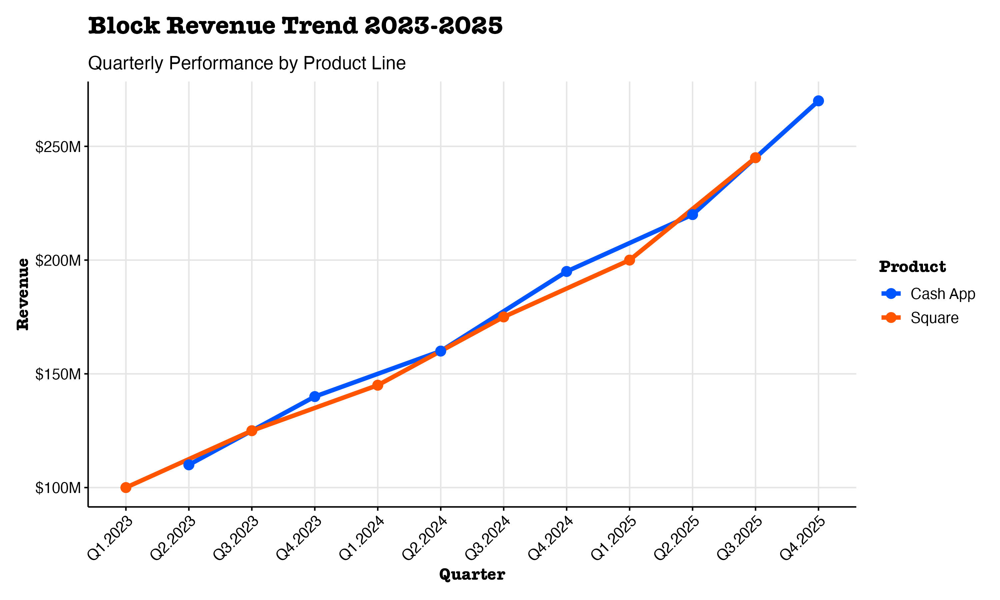
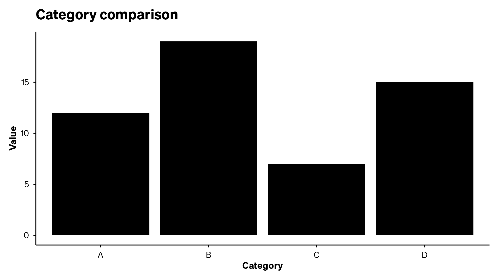

# gooseR

[](#)
[](LICENSE)

gooseR brings Goose AI into R with a user-first toolkit for analysis, visualization, and workflows.

- Seamless memory integration (save/load/list/delete any R object)
- Universal branding system (Block-ready themes, CSS, R Markdown)
- AI assistant functions (ask, review, document, optimize)
- Advanced features (streaming, caching, async, templates)
- IDE addins (RStudio/Positron) for one-click actions

## Installation

```r
# Install from GitHub (private repo)
# remotes::install_github("blockbtheriault/gooseR")
```

## Quick Start

```r
library(gooseR)
# Ask Goose for help
# goose_ask("Summarize mtcars and suggest visualizations")

# Save and load objects from Goose memory
# goose_save(mtcars, category = "demo", tags = c("cars","example"))
# objs <- goose_list(category = "demo")
# restored <- goose_load(objs[[1]]$path)

# Brand your charts
# library(ggplot2)
# ggplot(mtcars, aes(wt, mpg)) + geom_point() + theme_brand("block")
```

## Feature Overview

- Memory: goose_save(), goose_load(), goose_list(), goose_delete()
- Branding: theme_brand(), brand_palette(), brand_css(), brand_rmd_template()
- AI Assistant: goose_ask(), goose_review_code(), goose_document(), goose_generate_tests()
- Advanced: goose_stream(), goose_cache_set/get(), goose_batch(), goose_template()
- IDE Addins: one-click review, docs, tests, and more

## Visual Examples

<p align="center">
  
  
</p>

More in docs/assets and inst/examples.

## Common Use Cases

- People Analytics: rapid EDA, branded visuals, AI-driven insights
- Sales Analysis: async analysis, caching, automated reporting
- Code Review: quality checks, test generation, documentation

Run the enhanced examples in `examples/`:

```r
source("examples/use_case_people_analytics.R")
source("examples/use_case_sales.R")
source("examples/use_case_code_review.R")
```

## Documentation

- User Guides: vignettes/
- Examples: inst/examples and examples/
- Technical Docs: docs/development
- Phase summaries: docs/phases

## Contributing

See [CONTRIBUTING.md](CONTRIBUTING.md) and our [Code of Conduct](CODE_OF_CONDUCT.md).

## License

MIT License. See [LICENSE](LICENSE).

